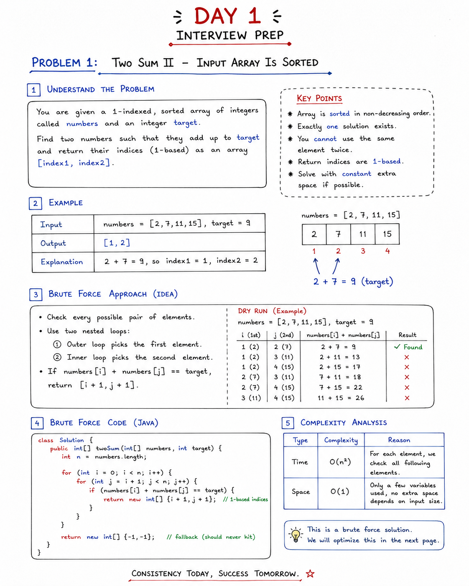
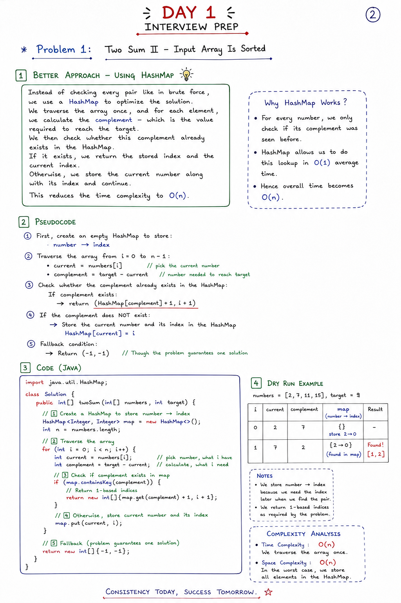
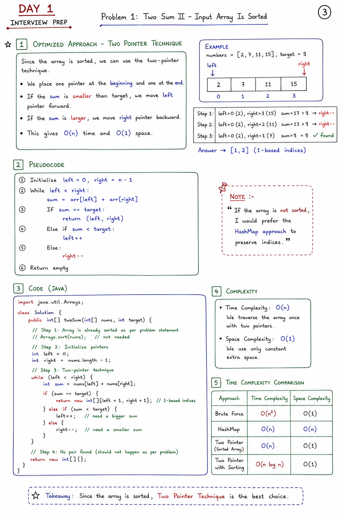

# 001 - Two Sum II (Input Array Is Sorted)

## 🎯 Problem

Given an array of integers `numbers` that is already sorted in non-decreasing order, find two numbers such that they add up to a specific `target` number.

Return the indices of the two numbers (1-indexed) as an integer array `answer` of size 2.

You may assume that each input has exactly one solution and you may not use the same element twice.

### Example

```text
Input:
numbers = [1, 2, 3, 4, 6]
target = 6

Output:
[2, 4]

Explanation:
2nd element (2) + 4th element (4) = 6
```

## 🔒 Constraints

* `2 <= numbers.length <= 3 * 10^4`
* `-1000 <= numbers[i] <= 1000`
* `numbers` is sorted in non-decreasing order
* `-1000 <= target <= 1000`

---

## 🎥 Interview Prep — Day 1 / ∞

This problem is part of my **Interview Preparation Journey**.

I explored multiple approaches step by step:

**Brute Force → HashMap → Two Pointer ⭐**

▶️ **[Watch my solution on YouTube](YOUR_YOUTUBE_LINK_HERE)**

---

# ✍️ My Handwritten Interview Notes

These pages show my step-by-step thinking while solving the problem — from understanding the problem to finding the optimal solution.

## 📄 Page 1 — Understanding the Problem & Brute Force



---

## 📄 Page 2 — HashMap Approach



---

## 📄 Page 3 — Two Pointer Approach ⭐



---

# 💡 Approaches

## 1. Brute Force

The simplest approach is to check every possible pair of elements.

We use two nested loops:

```text
for every i:
    for every j after i:
        if numbers[i] + numbers[j] == target:
            return the indices
```

### Complexity

* **Time:** `O(n²)`
* **Space:** `O(1)`

---

## 2. HashMap

Instead of checking every pair, we store previously seen numbers in a HashMap.

For every current number:

```text
complement = target - current
```

If the complement already exists in the HashMap, we have found the required pair.

Otherwise, store:

```text
number → index
```

### Complexity

* **Time:** `O(n)`
* **Space:** `O(n)`

This approach is especially useful when the array is **not sorted**.

---

## 3. Two Pointer ⭐ Optimal

Because the array is already sorted, we can use the **Two Pointer technique**.

Initialize:

```text
left = 0
right = n - 1
```

Then calculate:

```text
sum = numbers[left] + numbers[right]
```

### If `sum == target`

We found the answer.

### If `sum < target`

We need a bigger sum, so move:

```text
left++
```

### If `sum > target`

We need a smaller sum, so move:

```text
right--
```

This gives us:

* **Time:** `O(n)`
* **Space:** `O(1)`

---

# 🧪 Two Pointer Dry Run

```text
numbers = [1, 2, 3, 4, 6]
target = 6
```

### Step 1

```text
left = 0 → 1
right = 4 → 6

sum = 1 + 6 = 7

7 > 6
→ right--
```

### Step 2

```text
left = 0 → 1
right = 3 → 4

sum = 1 + 4 = 5

5 < 6
→ left++
```

### Step 3

```text
left = 1 → 2
right = 3 → 4

sum = 2 + 4 = 6

6 == 6
→ answer = [2, 4]
```

---

# 🧩 Pseudocode

```text
left = 0
right = n - 1

while left < right:

    sum = numbers[left] + numbers[right]

    if sum == target:
        return [left + 1, right + 1]

    if sum < target:
        left++

    else:
        right--
```

---

# ✅ Optimal Java twoSumII

```java
class twoSumII {
    public int[] twoSum(int[] numbers, int target) {

        int left = 0;
        int right = numbers.length - 1;

        while (left < right) {

            int sum = numbers[left] + numbers[right];

            if (sum == target) {
                return new int[]{left + 1, right + 1};
            }

            if (sum < target) {
                left++;
            } else {
                right--;
            }
        }

        return new int[]{-1, -1};
    }
}
```

---

# 📊 Complexity Comparison

| Approach      |    Time |  Space |
| ------------- | ------: | -----: |
| Brute Force   | `O(n²)` | `O(1)` |
| HashMap       |  `O(n)` | `O(n)` |
| Two Pointer ⭐ |  `O(n)` | `O(1)` |

---

# 🧠 Key Takeaway

The important part of this problem is not just finding a solution. It is recognizing that the **sorted property of the array gives us an opportunity to optimize**.

```text
Brute Force
     ↓
HashMap
     ↓
Two Pointer ⭐
```

For a **sorted array**, the Two Pointer technique is the best choice because it gives:

**O(n) Time + O(1) Extra Space**

If the array were **not sorted**, I would consider using a **HashMap** instead.

---

## 📁 Files

* `twoSumII.java` — Java implementation of the optimal Two Pointer solution.
* `notes/` — Handwritten interview preparation notes.

---

### 🚀 Interview Prep Progress

**Day 1 / ∞**

**Problem 001 — Two Sum II**

> Understand → Practice → Optimize → Repeat
